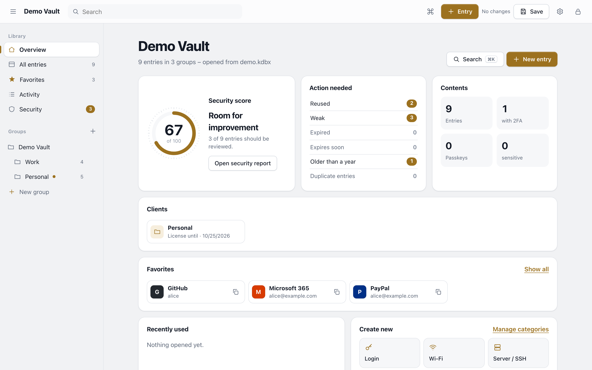
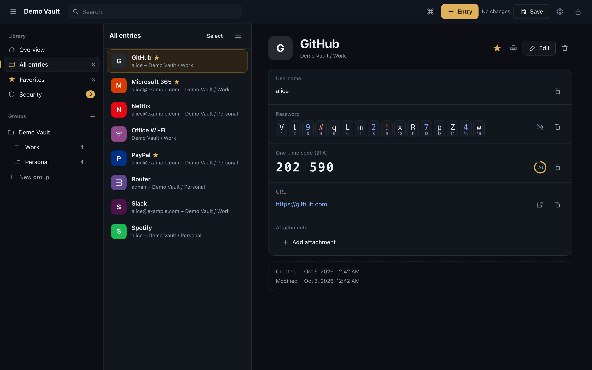
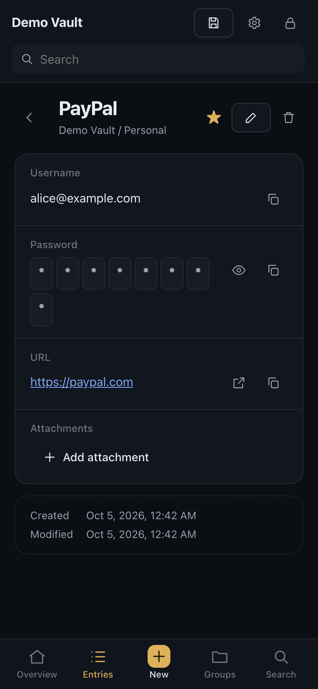

# Tresor

**A KeePass-compatible password manager in a single HTML file.** Open, edit and create KDBX databases entirely in your browser – offline, without a server, without dependencies.



> **Try it:** [https://techflow-it.github.io/tresor/](https://techflow-it.github.io/tresor/) · **Download:** [latest release](https://github.com/techflow-it/tresor/releases/latest)
>
> The user interface is available in **English** and **German**. It follows your browser language and can be switched on the start screen or in Settings.

## Why Tresor?

- **One file, zero dependencies.** Everything – KDBX parser, Argon2, AES, ChaCha20, TOTP, QR codes – is implemented in the file itself. No CDN, no npm packages, nothing to trust but the code you can read here.
- **Nothing leaves your device.** A strict Content Security Policy blocks every network request. Your database is decrypted in memory and saved back as a file.
- **Works with what you already use.** Databases stay fully compatible with KeePass, KeePassXC, Strongbox and KeePassDX.

## Features

| Area | What you get |
| --- | --- |
| Formats | KDBX 3.1 and 4.x · AES-256 and ChaCha20 · Argon2d/id and AES-KDF · key files |
| Speed | Argon2 in WebAssembly (about 10× faster than plain JavaScript) with selectable strength |
| Entries | Groups, custom fields, attachments, history with visual diffs, recycle bin, undo |
| Security | Security report and score, password rotation assistant, re-authentication for sensitive entries, auto-lock, clipboard clearing |
| 2FA & passkeys | TOTP codes (KeePassXC, KeePass 2 and KeeOtp formats) · stores KeePassXC/Strongbox passkeys |
| Productivity | Command palette (⌘K), keyboard navigation, drag & drop, multi-select, favourites, customisable entry categories |
| Data | Merge two versions of a database · CSV import (Bitwarden, 1Password, LastPass, Chrome, Firefox, Apple, KeePassXC) · CSV export |
| Languages | English and German interface, passphrase word lists in both languages |
| Sharing & print | Export a group as its own encrypted database · Wi-Fi cards with QR code · emergency sheet |

<p align="center"> </p>

## Getting started

1. Download `Tresor.html` from the [latest release](https://github.com/techflow-it/tresor/releases/latest) and open it in a current browser – or use the [hosted version](https://techflow-it.github.io/tresor/).
2. Choose an existing `.kdbx` file or create a new database.
3. Changes are saved by downloading the updated file (Safari, Brave) or written back directly (Chrome, Edge).

**Verify your download:**

```
shasum -a 256 Tresor.html
```

Compare the result with `Tresor.html.sha256` in the release.

## Security

Tresor has **not been independently audited.** The cryptographic primitives are implemented in this repository and verified against official test vectors (RFC 9106, RFC 6238, eSTREAM) and Node.js' crypto library; written files are checked by an independent reader. Please read [SECURITY.md](SECURITY.md) for the security model, its limits and how to report vulnerabilities.

Opening Tresor over plain `http://` from another machine is possible but not recommended: anyone on the network could tamper with the page in transit. Use the HTTPS version, a local file, or an encrypted tunnel.

## Building and testing

```
python3 tools/build.py        # builds dist/Tresor.html deterministically
node tests/run-all.js         # 100+ tests: Argon2, AES, SHA, ChaCha20, TOTP, KDBX, merge, CSV
pip install cryptography && python3 tests/verify.py   # independent KDBX reader
```

The build is reproducible: building the same commit always yields the same SHA-256 checksum.

## License

Tresor is free software, licensed under the [GNU General Public License v3.0 or later](LICENSE). It comes **without any warranty**. Keep backups of your databases.

KeePass is a project by Dominik Reichl; Tresor is an independent project and not affiliated with it. Brand names shown for colour coding belong to their respective owners.

Tresor was developed with the assistance of AI (Anthropic's Claude) and reviewed, tested and published by its author.
